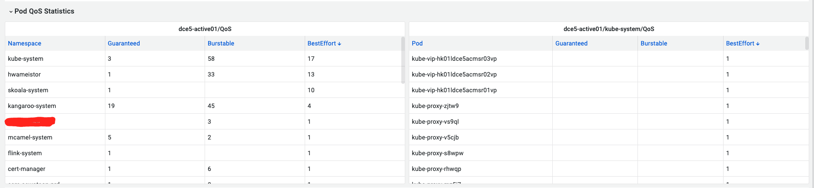

#  在 Kubernetes 中设置 QoS


# Guaranteed QoS（保证型）
对于一个 Pod 中的每个容器，需要将 CPU 和内存的请求（request）和限制（limit）设置为相同的值。这里将 CPU 请求和限制都设置为 1 个核心，内存请求和限制都设置为 1GiB。这样，这个 Pod 中的容器就会被分配到 Guaranteed QoS 类别。
``` yaml
apiVersion: v1
kind: Pod
metadata:
  name: my - guaranteed - pod
spec:
  containers:
  - name: my - container
    image: my - image
    resources:
      requests:
        cpu: "1"
        memory: "1Gi"
      limits:
        cpu: "1"
        memory: "1Gi"
```
# Burstable QoS（突发型）
在 Pod 配置文件中，为每个容器设置 CPU 和内存请求（request），并可以根据需要设置 CPU 和内存限制（limit）。如果不设置限制，容器可以在节点资源允许的情况下突发使用资源。例如：
``` yaml
apiVersion: v1
kind: Pod
metadata:
  name: my - burstable - pod
spec:
  containers:
  - name: my - container
    image: my - image
    resources:
      requests:
        cpu: "0.5"
        memory: "512Mi"
      limits:
        cpu: "1"
        memory: "1Gi"
```
在这个例子中，CPU 请求为 0.5 个核心，内存请求为 512MiB。CPU 限制为 1 个核心，内存限制为 1GiB。这意味着该容器至少会获得 0.5 个核心的 CPU 时间和 512MiB 的内存，并且在资源充足的情况下，CPU 最多可以使用到 1 个核心，内存最多可以使用到 1GiB。
# Best - Effort QoS（尽力而为型）
在 Pod 配置文件中，对于容器不设置资源请求和限制，例如：
``` yaml
apiVersion: v1
kind: Pod
metadata:
  name: my - best - effort - pod
spec:
  containers:
  - name: my - container
    image: my - image
```